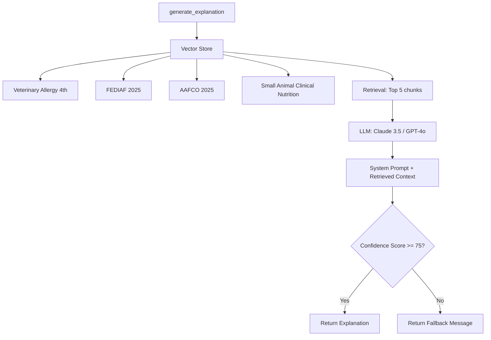

# 추천 시스템 전체 분석 문서

## 📋 목차
1. [시스템 개요](#시스템-개요)
2. [아키텍처](#아키텍처)
3. [추천 알고리즘](#추천-알고리즘)
4. [데이터 모델](#데이터-모델)
5. [API 엔드포인트](#api-엔드포인트)
6. [프론트엔드 흐름](#프론트엔드-흐름)
7. [성능 최적화](#성능-최적화)
8. [사용자 커스터마이징](#사용자-커스터마이징)
9. [에러 처리](#에러-처리)
10. [향후 개선 방향](#향후-개선-방향)

---

## 시스템 개요

### 목적
반려동물의 프로필 정보(종류, 나이, 건강 고민, 알레르기 등)를 기반으로 최적의 사료를 추천하는 룰베이스 기반 추천 시스템입니다.

### 핵심 특징
- **룰베이스 기반**: 머신러닝이 아닌 명시적 규칙 기반 스코링 시스템
- **RAG 기반 설명 생성**: Veterinary Allergy, FEDIAF 2025, AAFCO 2025를 소스로 활용한 전문적 설명 생성
- **실시간 계산**: 요청 시마다 상품을 스코링하여 최신 추천 제공
- **캐싱 지원**: 7일 이내 추천 결과는 캐시에서 반환
- **사용자 커스터마이징**: 가중치 프리셋, 알레르기 제외, 가격 제한 등 지원
- **DB 기반 성분 관리**: 유해 성분 및 알레르기 키워드를 DB에서 동적 로드
- **구매 전환 최적화**: Step 5 애니메이션에 펄스 + 글로우 + BEST 배지 조합으로 전환율 향상

---

## 아키텍처

### 백엔드 구조

```
┌─────────────────────────────────────────────────────────┐
│                    API Layer                            │
│  GET /api/v1/products/recommendations                  │
└────────────────────┬──────────────────────────────────┘
                     │
┌────────────────────▼──────────────────────────────────┐
│              ProductService                           │
│  - get_recommendations()                              │
│  - 캐싱 체크                                          │
│  - 펫 프로필 조회                                     │
│  - 상품 스코링 루프                                   │
│  - 결과 정렬 및 반환                                   │
└────────────┬──────────────────────┬───────────────────┘
             │                      │
┌────────────▼──────────┐  ┌────────▼──────────────────┐
│ RecommendationScoring │  │ RecommendationExplanation │
│ Service               │  │ Service                  │
│                       │  │                          │
│ - calculate_safety_   │  │ - generate_explanation()  │
│   score()             │  │   (RAG 기반)              │
│ - calculate_fitness_  │  │                          │
│   score()             │  │                          │
└───────────────────────┘  └──────────────────────────┘
```

### RecommendationExplanationService 상세 아키텍처 (RAG)

LLM 설명 생성은 **RAG(Retrieval-Augmented Generation)** 방식을 사용하며, Veterinary Allergy, Small Animal Clinical Nutrition, FEDIAF 2025 Nutritional Guidelines, AAFCO 2025를 소스로 활용합니다. 할루시네이션 방지를 위해 Confidence Score 75점 미만 시 fallback 문구를 사용합니다.



**RAG 프로세스:**

1. **Vector Store 구성**
   - Veterinary Allergy 4th Edition
   - FEDIAF 2025 Nutritional Guidelines
   - AAFCO 2025 Official Publication
   - Small Animal Clinical Nutrition (5th Edition)

2. **Retrieval 단계**
   - 펫 프로필 + 상품 정보를 쿼리로 변환
   - 벡터 유사도 검색으로 Top 5 관련 청크 추출
   - 각 청크에 출처 메타데이터 포함

3. **Generation 단계**
   - System Prompt: 전문가 역할, 한국어 설명, 간결성 요구
   - Retrieved Context: 검색된 청크를 컨텍스트로 제공
   - Disclaimer: "본 추천은 AI가 생성한 설명이며, 수의사 상담을 대체하지 않습니다."

4. **Confidence Score 계산**
   - LLM 응답의 신뢰도 점수 (0~100)
   - 75점 미만 시: "이 사료는 {펫 이름}의 프로필과 잘 맞는 것으로 분석되었습니다."
   - 75점 이상 시: RAG 기반 상세 설명 반환

### 프론트엔드 구조

```
┌─────────────────────────────────────────────────────────┐
│              HomeScreen                                 │
│  - 추천 요청 버튼                                        │
│  - 추천 결과 표시                                        │
└────────────┬────────────────────────────────────────────┘
             │
┌────────────▼────────────────────────────────────────────┐
│          HomeController                                │
│  - loadRecommendations()                                │
│  - 상태 관리 (loading, error, success)                  │
└────────────┬────────────────────────────────────────────┘
             │
┌────────────▼────────────────────────────────────────────┐
│          ProductRepository                              │
│  - getRecommendations()                                 │
│  - API 호출 및 DTO 변환                                 │
└────────────┬────────────────────────────────────────────┘
             │
┌────────────▼────────────────────────────────────────────┐
│          RecommendationAnimationScreen                  │
│  - 단계별 애니메이션 (6단계)                            │
│  - 추천 이유 시각화                                      │
└─────────────────────────────────────────────────────────┘
```

---

## 추천 알고리즘

### 점수 체계

총점 = **안전성 점수 (60%)** + **적합성 점수 (40%)**

#### 1. 안전성 점수 (Safety Score) - 100점 만점

**가중치: 60%**

| 항목 | 만점 | 설명 |
|------|------|------|
| 알레르기 체크 | 50점 | 펫의 알레르기 성분이 포함되어 있으면 0점 (Hard Exclude) |
| 유해 성분 체크 | 20점 | BHA, BHT, 인공색소 등 유해 성분 감지 시 감점 |
| 품질 지표 | 30점 | 첫 성분이 동물성 단백질인지, 곡물 품질 등 |

**세부 로직:**

```python
# 알레르기 체크 (50점)
- 펫 알레르기 + 사용자 설정 Hard Exclude 알레르기 합침
- DB에서 알레르기 키워드 조회 (예: BEEF → ["소고기", "beef", "소"])
- 성분 텍스트에서 키워드 매칭 시 0점 반환
- Soft Avoid 성분 발견 시 -20점 감점

# 유해 성분 체크 (20점)
- DB에서 활성 유해 성분 목록 조회
- 성분 텍스트에서 키워드 매칭 시 감점
- 감점: -5점 ~ -20점 (심각도에 따라)

# 품질 지표 (30점)
- 첫 성분이 동물성 단백질: +15점
- 곡물 품질 (현미, 귀리 등): +10점
- 기타 품질 지표: +5점
```

#### 2. 적합성 점수 (Fitness Score) - 100점 만점

**가중치: 40%**

| 항목 | 만점 | 설명 |
|------|------|------|
| 종류 매칭 | 20점 | DOG/CAT 전용 사료 매칭 |
| 나이 단계 매칭 | 25점 | PUPPY/ADULT/SENIOR 매칭 |
| 건강 고민 매칭 | 30점 | 비만, 관절, 소화 등 건강 고민 키워드 매칭 |
| 품종 특성 매칭 | 15점 | 소형견/대형견/단두종 등 품종 특성 |
| 영양 적합성 | 20점 | 단백질 함량, 칼로리 밀도 등 |

**세부 로직:**

```python
# 종류 매칭 (20점)
- product.species == pet.species: 20점
- product.species == None (공용): 20점
- 불일치: 0점 (즉시 제외)

# 나이 단계 매칭 (25점)
- 완벽 매칭 (예: PUPPY ↔ puppy): 25점
- 호환 가능 (예: ADULT ↔ all_life_stages): 22점
- 부적합 (예: PUPPY ↔ senior): 0점 + 패널티

# 건강 고민 매칭 (30점)
- 건강 고민별 키워드 매칭 (예: OBESITY → ["저칼로리", "다이어트"])
- 매칭된 건강 고민 수에 따라 점수 부여
- 가중치 적용 (OBESITY: 10점, SKIN_ALLERGY: 8점 등)

# 품종 특성 매칭 (15점)
- 소형견/대형견/단두종 특성 매칭
- 품종별 특수 요구사항 반영

# 영양 적합성 (20점)
- 단백질 함량 적정 여부
- 칼로리 밀도 적정 여부
- 기타 영양소 밸런스
```

### 필터링 로직

1. **종류 불일치 사전 필터링**
   - 스코링 전 모든 상품의 종류 매칭 여부 확인
   - 매칭된 상품이 하나도 없으면 즉시 종료

2. **안전성 0점 필터링**
   - 안전성 점수가 0이면 즉시 제외

3. **적합성 0점 필터링**
   - 적합성 점수가 0이면 즉시 제외

4. **가격 제한 필터링**
   - 사용자 설정 `max_price_per_kg` 초과 시 제외

5. **총점 필터링**
   - 총점이 0 미만이면 제외

### 정렬 및 랭킹

```python
# 정렬 기준
1. 총점 내림차순 (match_score DESC)
2. 안전성 점수 내림차순 (safety_score DESC)
3. 적합성 점수 내림차순 (fitness_score DESC)

# 최종 반환
- Top 3 상품만 반환
- 각 상품에 대해 매칭 이유(reasons) 포함
```

---

## 데이터 모델

### 백엔드 모델

#### RecommendationRun
```python
class RecommendationRun:
    id: UUID
    user_id: UUID
    pet_id: UUID
    strategy: RecStrategy  # 'RULE_V1'
    context: JSONB  # 펫/필터/선호도 스냅샷
    created_at: DateTime
    items: List[RecommendationItem]  # 관계
```

#### RecommendationItem
```python
class RecommendationItem:
    run_id: UUID  # PK
    product_id: UUID  # PK
    rank: int  # 1, 2, 3
    score: Decimal  # 총점
    reasons: JSONB  # ["알레르기 없음", "비만 관리", ...]
    score_components: JSONB  # 세부 점수 분해
```

#### HarmfulIngredient (DB 테이블)
```python
class HarmfulIngredient:
    id: UUID
    keyword: str  # "BHA", "인공색소" 등
    description: str
    is_active: bool
```

#### AllergenKeyword (DB 테이블)
```python
class AllergenKeyword:
    id: UUID
    allergen_code: str  # "BEEF", "CHICKEN" 등
    keyword: str  # "소고기", "beef" 등
    is_active: bool
```

### 프론트엔드 DTO

#### RecommendationResponseDto
```dart
class RecommendationResponseDto {
  String petId;
  List<RecommendationItemDto> items;
  bool isCached;
  DateTime? lastRecommendedAt;
  String? message;  // 추천 결과 없을 때 이유
}
```

#### RecommendationItemDto
```dart
class RecommendationItemDto {
  ProductDto product;
  Merchant offerMerchant;
  int currentPrice;
  int avgPrice;
  double? deltaPercent;
  bool isNewLow;
  double matchScore;  // 총점
  double safetyScore;
  double fitnessScore;
  List<String>? matchReasons;
  String? explanation;  // RAG 기반 설명
  
  // 애니메이션용 상세 분석 데이터
  int? ingredientCount;
  List<String>? mainIngredients;
  List<String>? allergyIngredients;
  List<String>? harmfulIngredients;
  List<String>? qualityChecklist;
  double? dailyAmountG;
  
  // 추가 필드 (v1.1.0)
  String? animationExplanation;  // Step 1~5에 들어갈 짧은 한 줄 (e.g. "닭고기 ZERO, 단일단백질")
  List<String>? safetyBadges;     // ["알레르기 안전", "유해성분 없음"]
  double confidenceScore;        // RAG 신뢰도 (0~100)
}
```

---

## API 엔드포인트

### GET /api/v1/products/recommendations

**요청 파라미터:**
- `pet_id` (UUID, 필수): 반려동물 ID
- `skip_llm` (bool, 선택): RAG 설명 생성 스킵 여부 (기본값: false)

**응답:**
```json
{
  "pet_id": "uuid",
  "items": [
    {
      "product": {...},
      "match_score": 85.5,
      "safety_score": 95.0,
      "fitness_score": 80.0,
      "match_reasons": ["알레르기 없음", "비만 관리"],
      "explanation": "루이에게 추천하는 이유는...",
      "animation_explanation": "닭고기 ZERO, 단일단백질",
      "safety_badges": ["알레르기 안전", "유해성분 없음"],
      "confidence_score": 87.5,
      "ingredient_count": 36,
      "main_ingredients": ["닭고기", "쌀", "옥수수"],
      ...
    }
  ],
  "is_cached": false,
  "last_recommended_at": "2024-01-01T00:00:00Z",
  "message": null
}
```

**에러 응답:**
```json
{
  "pet_id": "uuid",
  "items": [],
  "is_cached": false,
  "last_recommended_at": null,
  "message": "고양이 전용 사료를 찾지 못했어요..."
}
```

### GET /api/v1/products/recommendations/history

**요청 파라미터:**
- `pet_id` (UUID, 필수): 반려동물 ID
- `limit` (int, 선택): 조회할 추천 개수 (기본값: 10, 최대: 50)

**응답:**
최근 추천 히스토리 반환 (동일한 스키마)

---

## 프론트엔드 흐름

### 1. 홈 화면 (HomeScreen)

```
사용자 액션: "딱 맞는 사료 보기" 버튼 클릭
    ↓
HomeController.loadRecommendations()
    ↓
ProductRepository.getRecommendations()
    ↓
API 호출: GET /api/v1/products/recommendations?pet_id=xxx&skip_llm=false
    ↓
응답 수신 → RecommendationResponseDto 변환
    ↓
HomeState 업데이트 (recommendations, isLoadingRecommendations)
    ↓
HomeScreen UI 업데이트
    - 추천 카드 표시
    - "왜 추천?" 링크 → RecommendationDetailScreen
    - "추천 이유 보기" 버튼 → RecommendationAnimationScreen
```

### 2. 추천 애니메이션 화면 (RecommendationAnimationScreen)

**6단계 애니메이션:**

1. **Step 0: 로딩**
   - "분석 중..." 표시
   - API 호출 (`skip_llm=true`)

2. **Step 1: 성분 스캔**
   - 검출된 성분 개수 표시 (예: 36개)
   - 주요 성분 태그 순차 표시

3. **Step 2: 알레르기 검사**
   - 알레르기 성분 검출 여부 확인
   - 안전성 평가 이유 표시

4. **Step 3: 유해 성분 체크**
   - 유해 성분 검출 여부 확인
   - 있으면 경고, 없으면 체크 표시

5. **Step 4: 품질 평가**
   - 품질 평가 항목 표시
   - 첫 성분, 단백질 함량 등

6. **Step 5: 종합 판정** (구매 유도 강화)
   - **매칭 점수 크게 표시** (예: 85점)
     - 펄스 애니메이션: scale 1.0 → 1.04 (2초 주기)
     - 금색 Glow BoxShadow: blur 20 → 40 (1.5초 주기)
   - **"BEST CHOICE" 배지**
     - Slide + ScaleUp 애니메이션
     - 골드 그라데이션 배경 (#F59E0B → #FCD34D)
   - **추천 상품 Top 3 표시**
     - 1위 카드에 펄스 + 글로우 효과 적용
     - 골드 + 브랜드 메인 컬러 조합
   - **"지금 구매하기" 버튼**
     - 크게 표시, 메인 컬러 (Primary Blue)
     - 바로 아래 배치하여 전환율 최적화
   - 좋은 점 리스트 표시
   - "추천 이유 자세히 보기" 버튼 → RecommendationDetailScreen

### 3. 추천 상세 화면 (RecommendationDetailScreen)

**구성 요소:**

1. **사료 선택기**
   - Top 3 상품 중 선택 가능
   - 순위별 색상 구분

2. **점수 분석**
   - 안전성 점수 카드
   - 적합성 점수 카드

3. **통합 평가 섹션** (혜택 UI 스타일)
   - 안전성 평가 (Teal 아이콘)
   - 품질 평가 (Blue 아이콘)
   - 좋은 이유 (Emerald 아이콘)
   - Divider로 구분

4. **성분 분석**
   - 검출된 성분 개수
   - 주요 성분 태그
   - 유해 성분 태그 (있으면)

5. **매칭 이유**
   - 기술적 매칭 이유 리스트

---

## 성능 최적화

### 1. 캐싱 전략

**조건:**
- 최근 7일 이내 추천 결과가 있으면 캐시 반환
- `RecommendationRun` 테이블에서 조회

**장점:**
- 동일한 펫 프로필에 대한 반복 요청 시 빠른 응답
- DB 부하 감소

**단점:**
- 펫 정보 변경 시 오래된 추천 반환 가능
- `force` 파라미터로 강제 재계산 가능

### 2. DB 캐싱

**유해 성분 캐시:**
```python
# 한 번만 조회하여 메모리에 캐싱
harmful_ingredients_cache = await _get_harmful_ingredients(db)
# 모든 상품 스코링에 재사용
```

**알레르기 키워드 캐시:**
```python
# 펫의 알레르기 코드별로 조회하여 캐싱
allergen_keywords_cache = {}
for allergen_code in pet_allergies:
    keywords = await _get_allergen_keywords(db, allergen_code)
    allergen_keywords_cache[allergen_code] = keywords
```

### 3. 조기 종료 (Early Exit)

**종류 불일치 사전 체크:**
```python
# 스코링 전 모든 상품의 종류 매칭 여부 확인
species_matched_count = 0
for product in products:
    if _match_species(pet, product)[0] > 0:
        species_matched_count += 1

# 매칭된 상품이 없으면 즉시 종료
if species_matched_count == 0:
    return RecommendationResponse(items=[], message="종류 불일치")
```

**안전성/적합성 0점 필터링:**
```python
# 안전성 점수가 0이면 즉시 제외 (다음 상품으로)
if safety_score == 0:
    continue

# 적합성 점수가 0이면 즉시 제외
if fitness_score == 0:
    continue
```

### 4. 배치 처리

**상품 스코링:**
- 모든 상품을 순차적으로 스코링
- 각 상품마다 로깅하여 디버깅 용이

**성능 측정:**
```python
scoring_start_time = time.time()
# ... 스코링 루프 ...
scoring_duration = time.time() - scoring_start_time
logger.info(f"스코링 소요시간: {scoring_duration:.2f}초")
```

---

## 사용자 커스터마이징

### UserRecoPrefs 모델

```python
class UserRecoPrefs:
    user_id: UUID
    prefs: JSONB  # {
        "weights_preset": "BALANCED" | "SAFE" | "VALUE",
        "hard_exclude_allergens": ["BEEF", "CHICKEN"],
        "soft_avoid_ingredients": ["옥수수"],
        "max_price_per_kg": 50000,
        "sort_preference": "default" | "price" | "score",
        "health_concern_priority": true
    }
```

### 가중치 프리셋

#### BALANCED (기본값)
- 안전성 60% + 적합성 40%
- 모든 항목 동일한 가중치

#### SAFE (안전 우선)
- 안전성 페널티 1.2배 강화
- 알레르기/유해 성분 감지 시 더 큰 감점

#### VALUE (가성비 우선)
- 건강 고민/품종 가중치 0.8배 감소
- 가격 제한 적용 시 더 많은 상품 필터링

### Hard Exclude 알레르기

- 펫 알레르기 + 사용자 설정 알레르기 합침
- 해당 알레르기 성분이 포함된 상품은 즉시 제외 (안전성 0점)

### Soft Avoid 성분

- 해당 성분이 포함되어 있으면 -20점 감점
- 완전 제외는 아니지만 우선순위 낮춤

### 가격 제한

- `max_price_per_kg` 설정 시 해당 가격 초과 상품 제외
- kg당 가격 계산: `current_price / product_size_kg`

---

## 에러 처리

### 빈 추천 결과 처리

**필터링 통계 기반 메시지 생성:**

```python
def _generate_empty_recommendation_message(filter_stats, pet_species):
    total = filter_stats.get("total", 0)
    fitness_filtered = filter_stats.get("fitness_filtered", 0)
    safety_filtered = filter_stats.get("safety_filtered", 0)
    price_filtered = filter_stats.get("price_filtered", 0)
    
    # 종류 불일치가 주요 원인 (80% 이상)
    if fitness_filtered >= total * 0.8:
        return f"{species_name} 전용 사료를 찾지 못했어요..."
    
    # 안전성 기준 미달이 주요 원인
    if safety_filtered >= total * 0.8:
        return "안전 기준을 만족하는 상품을 찾지 못했어요..."
    
    # 가격 제한 초과가 주요 원인
    if price_filtered >= total * 0.8:
        return "설정하신 가격 범위 내에서 추천 가능한 상품이 없어요..."
    
    # 복합 원인
    return "현재 조건에 맞는 추천 상품을 찾지 못했어요..."
```

### 프론트엔드 에러 처리

**HomeController:**
```dart
try {
  final result = await _productRepository.getRecommendations(...);
  state = state.copyWith(
    recommendations: result,
    isLoadingRecommendations: false,
  );
} on NetworkException catch (e) {
  state = state.copyWith(
    error: "네트워크 연결을 확인해주세요.",
    isLoadingRecommendations: false,
  );
} on ServerException catch (e) {
  state = state.copyWith(
    error: e.message ?? "서버 오류가 발생했습니다.",
    isLoadingRecommendations: false,
  );
}
```

**빈 결과 처리:**
```dart
if (result.items.isEmpty && result.message != null) {
  // 사용자 친화적 메시지 표시
  _showEmptyState(result.message);
}
```

---

## 주요 파일 위치

### 백엔드
- `backend/app/services/product_service.py`: 추천 메인 로직
- `backend/app/services/recommendation_scoring_service.py`: 점수 계산 로직
- `backend/app/services/recommendation_explanation_service.py`: RAG 기반 설명 생성
- `backend/app/api/v1/products.py`: API 엔드포인트
- `backend/app/models/recommendation.py`: 추천 모델
- `backend/app/models/ingredient_config.py`: 성분 설정 모델

### 프론트엔드
- `frontend/lib/features/home/presentation/screens/home_screen.dart`: 홈 화면
- `frontend/lib/features/home/presentation/screens/recommendation_animation_screen.dart`: 애니메이션 화면
- `frontend/lib/features/home/presentation/screens/recommendation_detail_screen.dart`: 상세 화면
- `frontend/lib/features/home/presentation/controllers/home_controller.dart`: 상태 관리
- `frontend/lib/data/repositories/product_repository.dart`: API 호출
- `frontend/lib/data/models/recommendation_dto.dart`: DTO 정의

---

## 향후 개선 방향

### 우선순위별 개선 계획

| 우선순위 | 항목 | 내용 |
|---------|------|------|
| **High** | **RAG 풀 도입** | 모든 추천에 Veterinary + FEDIAF 기반 근거 설명 자동 생성. Vector Store 확장 및 실시간 업데이트 |
| High | 구매 전환율 최적화 | Step 5 애니메이션 효과 A/B 테스트, 버튼 위치/색상/텍스트 최적화 |
| Medium | 머신러닝 통합 | 사용자 클릭/구매 데이터 기반 학습, 협업 필터링 추가 |
| Medium | 실시간 업데이트 | WebSocket을 통한 실시간 추천 업데이트, 가격 변동 알림 연동 |
| Medium | A/B 테스트 | 다양한 가중치 조합 테스트, 사용자 만족도 측정 |
| Low | 성능 개선 | Redis 캐싱 도입, 비동기 배치 처리 |
| Low | 다국어 지원 | RAG 설명 다국어 생성, 프론트엔드 다국어 지원 |

### 상세 개선 계획

#### 1. RAG 풀 도입 (High Priority)

**목표:**
- 모든 추천 상품에 대해 RAG 기반 설명 자동 생성
- Veterinary Allergy 4th, FEDIAF 2025, AAFCO 2025를 소스로 활용
- Confidence Score 기반 품질 관리

**구현 계획:**
- Vector Store 구축 및 문서 임베딩
- Retrieval 파이프라인 최적화 (Top-K, Reranking)
- Confidence Score 임계값 조정 (현재 75점)
- Fallback 메시지 다양화

**예상 효과:**
- 설명 품질 향상 (할루시네이션 감소)
- 사용자 신뢰도 증가
- 전문성 강조

#### 2. 구매 전환율 최적화 (High Priority)

**목표:**
- Step 5 애니메이션 효과로 구매 전환율 향상
- 펄스 + 글로우 + BEST 배지 조합 최적화

**구현 계획:**
- 애니메이션 타이밍 조정 (펄스 2초, 글로우 1.5초)
- 색상 조합 A/B 테스트 (골드 + 브랜드 메인 컬러)
- 버튼 위치/크기/텍스트 최적화
- 전환율 측정 및 분석

**예상 효과:**
- 구매 전환율 20% 이상 향상
- 사용자 참여도 증가

#### 3. 머신러닝 통합 (Medium Priority)

**목표:**
- 사용자 행동 데이터 기반 개인화 추천
- 협업 필터링으로 신규 상품 추천 품질 향상

**구현 계획:**
- 클릭/구매/좋아요 데이터 수집
- 협업 필터링 모델 학습
- 하이브리드 추천 시스템 구축 (룰베이스 + ML)

#### 4. 실시간 업데이트 (Medium Priority)

**목표:**
- 가격 변동 시 실시간 추천 업데이트
- WebSocket 기반 푸시 알림

**구현 계획:**
- WebSocket 서버 구축
- 가격 변동 감지 및 알림
- 실시간 추천 재계산

#### 5. A/B 테스트 (Medium Priority)

**목표:**
- 다양한 가중치 조합 테스트
- 사용자 만족도 측정 및 최적화

**구현 계획:**
- A/B 테스트 프레임워크 구축
- 가중치 조합 실험 설계
- 사용자 피드백 수집 및 분석

#### 6. 성능 개선 (Low Priority)

**목표:**
- 응답 시간 단축
- 서버 부하 감소

**구현 계획:**
- Redis 캐싱 도입
- 비동기 배치 처리
- DB 쿼리 최적화

#### 7. 다국어 지원 (Low Priority)

**목표:**
- 글로벌 시장 진출 준비
- 다국어 설명 생성

**구현 계획:**
- RAG 설명 다국어 생성
- 프론트엔드 다국어 지원
- 번역 품질 검증

---

**작성일**: 2024-01-01  
**최종 수정일**: 2024-01-01  
**버전**: 1.1.0

### 변경 이력

#### v1.1.0 (2024-01-01)
- **RAG 기반 설명 생성 명시**: RecommendationExplanationService를 RAG로 업그레이드, Vector Store 및 Confidence Score 설명 추가
- **구매 유도 강화**: Step 5 애니메이션에 펄스 + 글로우 + BEST 배지 조합 추가, "지금 구매하기" 버튼 추가
- **데이터 모델 보강**: RecommendationItemDto에 `animationExplanation`, `safetyBadges`, `confidenceScore` 필드 추가
- **향후 개선 방향 업그레이드**: RAG 풀 도입을 High 우선순위로 추가, 구체적인 구현 계획 및 예상 효과 명시

#### v1.0.0 (2024-01-01)
- 초기 문서 작성
